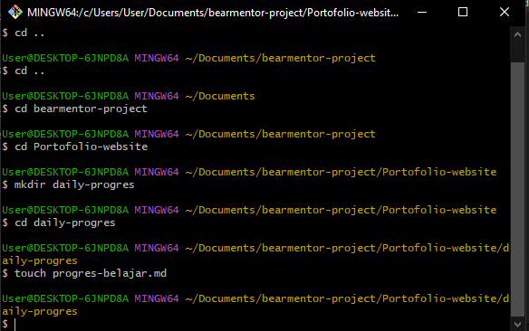
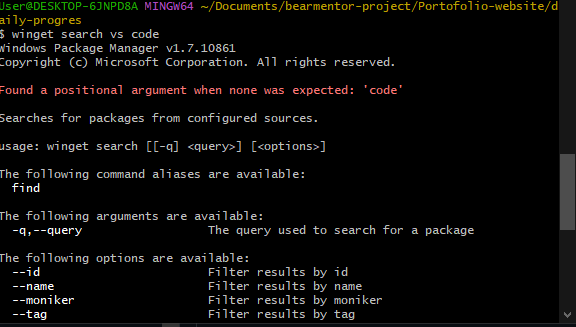
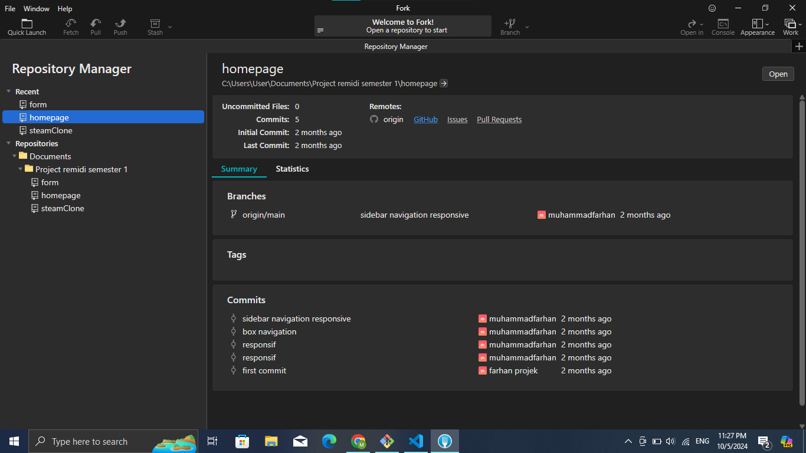
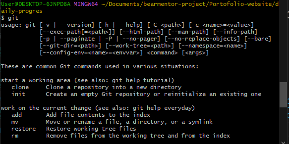

# Daily Progres
- CRUD with terminal
- Instal terminal package manager
- Instal git GUI and git CLI
- Using git for make repo
- Hosting repo to github

# Pictures

- #### CRUD 
  
- #### Instal terminal package manager 
  
- #### Instal git GUI and CLI 
   
  